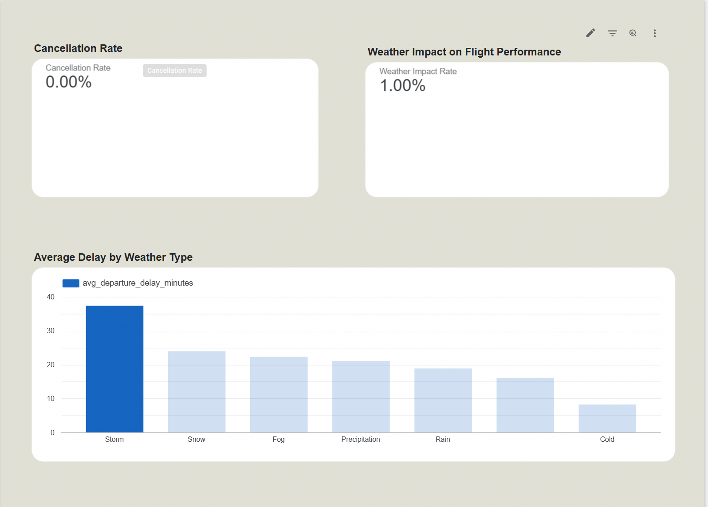

# ✈️ Flight & Weather Analytics Pipeline
## 🚀 Project Overview

An end-to-end data engineering pipeline that integrates flight and weather data to analyze the impact of weather conditions on flight delays and cancellations.

## 📌 Problem Description

Air travel is highly influenced by external factors such as weather conditions, which can significantly impact flight delays, cancellations, and ticket pricing. However, these relationships are often not clearly visible to travelers or analysts due to fragmented data sources and lack of integrated analysis.

This project aims to build an end-to-end data pipeline that combines flight data with weather data to analyze how weather conditions affect flight performance and pricing trends. By integrating these datasets, the project provides insights into patterns such as delays related to weather conditions, route-based trends, and temporal variations in flight behavior.

The pipeline ingests raw data from external sources, processes and transforms it using modern data engineering tools, and stores it in a cloud-based data warehouse for analytical querying. The final output is an interactive dashboard that enables users to explore key metrics such as average delays, price trends, and route performance.

This project demonstrates how data engineering workflows can be used to transform raw, unstructured data into actionable insights for travel analysis.

## 🧱 Tech Stack

- **Cloud**: Google Cloud Platform (GCP)
- **Infrastructure as Code (IaC)**: Terraform 
- **Workflow orchestration**: GitHub Actions
- **Data Warehouse**: BigQuery
- **Batch processing**: Python (Pandas, PyArrow)
- **Data transformation**: dbt
- **Visualization / Dashboard**: Looker Studio
- **Storage format**: Parquet
- **Version control**: GitHub
- **Environment management**: Python venv
- **Data Modeling**: Star Schema (fact & staging layers)

## 🏗️ Architecture

The project follows a modern data engineering architecture:

1. **Data Ingestion**  
   Flight and weather data are collected from external sources using Python scripts.

2. **Data Lake (Storage Layer)**  
   Raw data is stored locally (or in cloud storage) in Parquet format for efficient processing.

3. **Data Warehouse**  
   Processed data is loaded into BigQuery for analytical querying.

4. **Data Transformation**  
   dbt is used to transform raw data into structured models (staging and marts).

5. **Orchestration**  
   GitHub Actions is used to automate the pipeline execution, including ingestion and transformation steps.

6. **Visualization**  
   Looker Studio connects to BigQuery to create interactive dashboards for analysis.

## 🧩 Data Model

- `fact_flights`: Core flight metrics  
- `stg_weather`: Cleaned weather data  
- `fact_flights_weather`: Enriched dataset combining flights and weather

## 🔄 Pipeline Flow

```text
Data Source → Python Ingestion → Parquet → BigQuery → dbt → Dashboard
```   

## ☁️ Infrastructure (Terraform)

BigQuery dataset is provisioned using Terraform:

```bash
cd terraform
terraform init
terraform apply
```

## 📊 Dashboard

This project includes an interactive dashboard built with Looker Studio to analyze the impact of weather conditions on flight performance.


🔗 [View Dashboard](https://lookerstudio.google.com/s/uLRcgOfG6ag)



### Key Insights

- Weather events are associated with increased flight delays
- Severe conditions such as storms lead to the highest average delays
- Overall cancellation rate remains low, but weather still impacts performance

## ⚙️ How to Run

This project is fully reproducible. Follow the steps below to run the pipeline end-to-end.

```markdown
> **Authentication note:** Local execution uses Google ADC authentication.  
> For CI/CD execution in GitHub Actions, a service account-based setup would be required.
```

### 1. Clone the repository

```bash
git clone https://github.com/your-username/Flight-and-Weather-Analytics-Pipeline.git
cd Flight-and-Weather-Analytics-Pipeline
```
### 2. Install dependencies

```bash
pip install -r requirements.txt
```
### 3. Set up Google Cloud

Create a GCP project  
Enable BigQuery API  

For local development, authentication is done using:

```bash
gcloud auth application-default login
```

### 4. Run data ingestion
```bash
cd ingestion

python fetch_flight.py
python fetch_weather.py
python load_to_bigquery.py
```

### 5. Run dbt models

```bash
cd ../dbt_projects
dbt deps
dbt run
dbt test
```
### 6. Explore data

Query final table:

```sql
SELECT *
FROM `your_project.flight_data.fact_flights_weather`
LIMIT 10;
```

### 7. Open Dashboard

Open the Looker Studio dashboard using the link above.

## ⏱️ Orchestration

The pipeline was designed to be automated using GitHub Actions. It runs ingestion and transformation steps on schedule or manually.

Workflow file:
.github/workflows/pipeline.yml

The workflow includes the following steps:

- Process raw flight data  
- Process raw weather data  
- Load processed data into BigQuery  
- Run dbt transformations  
- Run dbt tests  

Note

During development, the pipeline was executed locally using Google Application Default Credentials (ADC) via:

gcloud auth application-default login

Because GitHub Actions requires non-interactive authentication, a service account or Workload Identity Federation would be needed for full cloud execution in CI/CD. This can be added as a future improvement.

